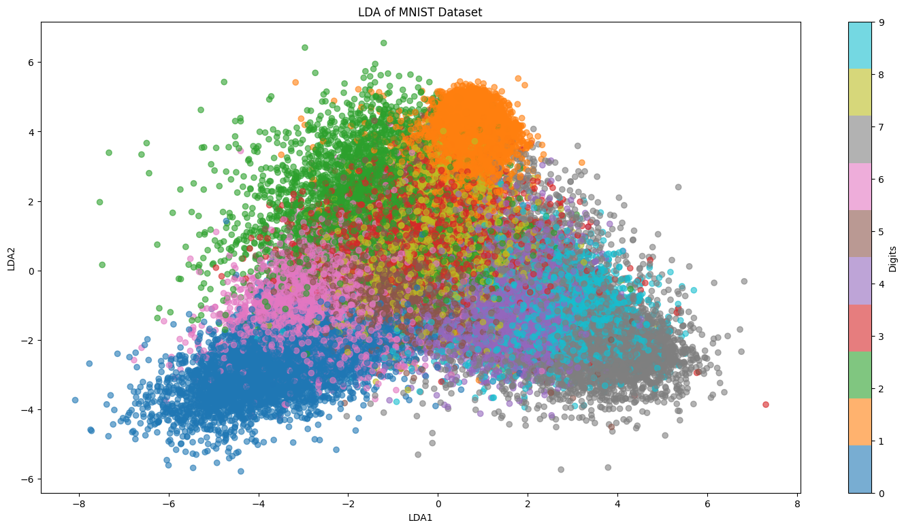
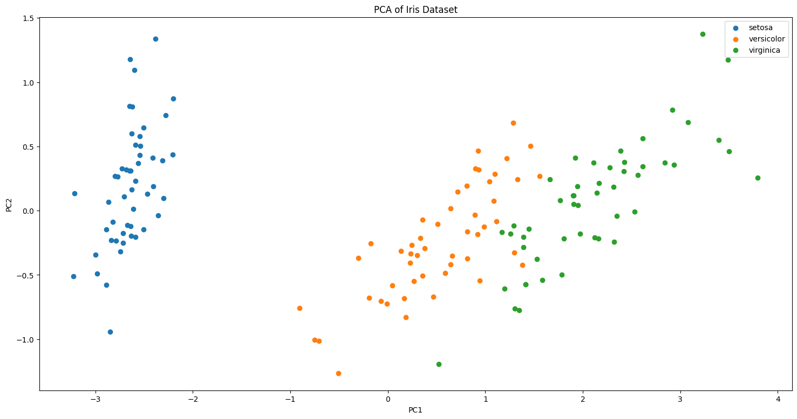

# Makine Öğrenimi Çalışma ve Analiz Projesi

## Genel Bakış
Bu depoda, makine öğrenimi algoritmaları, teknikleri ve süreçleri üzerine kapsamlı bir çalışma yer almaktadır. Gözetimli, gözetimsiz ve pekiştirmeli öğrenme yöntemlerinin uygulamaları, karşılaştırmaları ve değerlendirmeleri bulunmaktadır. Proje, makine öğrenimi kavramlarını kod, Jupyter not defterleri ve açıklayıcı görseller aracılığıyla anlamak, uygulamak ve görselleştirmek için bir kaynak olarak tasarlanmıştır.

Proje, sınıflandırma, regresyon, kümeleme, boyut indirgeme (LDA, PCA, t-SNE), model seçimi, hiperparametre ayarı ve çapraz doğrulama gibi geniş bir yelpazeyi kapsar ve pratik örnekler ile vaka çalışmalarını içerir. Sonuçlar ve karşılaştırmalara dair içgörüler sunmak için grafikler, diyagramlar ve çizelgeler kullanılmıştır.

## Proje Yapısı
Depo, kolay gezinme ve kullanım için düzenli bir şekilde yapılandırılmıştır:

- **/not_defterleri**: Makine öğrenimi algoritmalarının uygulamalarını ve gösterimlerini içeren Jupyter not defterleri.
  - `KararAgaci.ipynb`, `KararAgaci2.ipynb`, `KararAgaci3.ipynb`, `KararAgaci4.ipynb`: Karar Ağacı modelleri ve vaka çalışmaları.
  - `knn.ipynb`: K-En Yakın Komşu (KNN) uygulaması.
  - `LinearRegression.ipynb`, `MultiVariableLinearRegression.ipynb`, `MultiVariableLinearRegression2.ipynb`: Doğrusal ve çok değişkenli regresyon modelleri.
  - `LogisticRegression.ipynb`: Sınıflandırma için lojistik regresyon.
  - `NaiveBayes.ipynb`: Naive Bayes sınıflandırıcısı.
  - `PolynomialRegression.ipynb`: Polinom regresyon modelleri.
  - `RandomForest.ipynb`, `RandomForest2.ipynb`, `RandomForest3.ipynb`: Rastgele Orman modelleri ve karşılaştırmaları.
  - `SVM.ipynb`: Destek Vektör Makineleri (SVM) uygulaması.
  - `ClusteringAlgorithmsComparison.ipynb`: Kümeleme algoritmalarının karşılaştırması (K-Means, DBSCAN, Hiyerarşik).
  - `KMeansClustering.ipynb`, `Kmeans.ipynb`, `Kmeans1.ipynb`: K-Means kümeleme örnekleri.
  - `DBSCAN.ipynb`, `HierarchicalClustering.ipynb`: Diğer kümeleme teknikleri.
  - `LDA.ipynb`, `PCA.ipynb`, `TSNE.ipynb`: Boyut indirgeme teknikleri (Lineer Diskriminant Analizi, Temel Bileşen Analizi, t-Dağıtımlı Stokastik Komşu Yerleştirme).
  - `Qlearning.ipynb`: Pekiştirmeli öğrenme için Q-öğrenme uygulaması.
  - `GridSearchRandomSearchHyperparameterTuning.ipynb`, `CrossValidation.ipynb`, `FoldLeaveOneOutCrossValidation.ipynb`: Model değerlendirme ve hiperparametre ayarı.

- **/kodlar**: Yeniden kullanılabilir kodlar ve işlevler için Python betikleri.
  - `Vectorizer.py`: Özellik vektörizasyon araçları.
  - Veri ön işleme, model eğitimi ve değerlendirme için diğer betikler.

## 📊 Görselleştirmeler

Bu projede makine öğrenimi tekniklerinin çıktıları görselleştirilmiştir. Aşağıda yer alan grafik ve diyagramlar, modellerin analizini ve karşılaştırmasını kolaylaştırmak için oluşturulmuştur:

### 🧠 Gözetimli Öğrenme

- **output.png**  
  Karar ağacı modeli ile elde edilen sınıflandırma sonuçlarını veya model yapılarını görselleştirir.  
  

---

### 📉 Boyut İndirgeme Teknikleri

- **LDA.png**  
  Lineer Diskriminant Analizi ile elde edilen sınıflandırma veya boyut indirgeme sonuçlarını temsil eder.  
  

- **PCA.png**  
  Temel Bileşen Analizi (PCA) ile veri varyansını ve bileşen dağılımını görselleştirir.  
  

- **TSNE.png**  
  t-SNE ile yüksek boyutlu verinin 2D/3D uzayda temsilini gösterir.  
  

---

### 📦 Gözetimsiz Öğrenme

- **Kmeans.png & Kmeans1.png**  
  K-Means algoritmasının kümeleme sonuçlarını, küme merkezlerini ve veri noktalarının dağılımını gösterir.  
    
  

- **DBSCAN.png**  
  DBSCAN algoritmasının yoğunluk tabanlı kümeleme sonuçlarını temsil eder.  
  

- **HierarchicalClustering.png**  
  Hiyerarşik kümeleme algoritmasının çıktısı olan dendrogram yapısını gösterir.  
  


- **/belgeler**: Kılavuzlar ve dokümantasyon.
  - Her algoritma ve teknik için öğreticiler ve özetler.

## 🌟 Temel Özellikler
- **Gözetimli Öğrenme**: Karar Ağaçları, KNN, Doğrusal Regresyon, Lojistik Regresyon, Naive Bayes, Rastgele Orman, SVM ve Polinom Regresyon.
- **Gözetimsiz Öğrenme**: K-Means, DBSCAN, Hiyerarşik Kümeleme ve boyut indirgeme teknikleri (LDA, PCA, t-SNE).
- **Pekiştirmeli Öğrenme**: Q-öğrenme ile sıralı karar alma süreçleri.
- **Model Değerlendirme**: Çapraz doğrulama (Fold, Leave-One-Out), Izgara Arama ve Rastgele Arama ile hiperparametre optimizasyonu.
- **Görselleştirmeler**: Model performansını, kümeleme sonuçlarını ve veri içgörülerini gösteren zengin grafikler ve diyagramlar.
- **Vaka Çalışmaları**: Gerçek dünya problemlerine yönelik pratik uygulamalar ve analizler.

## Başlangıç

### 📌 Ön Koşullar

- Python 3.9 veya 3.12 sürümlerinden biri yüklü olmalıdır.  
  [Python indirme sayfası](https://www.python.org/downloads/) üzerinden uygun sürümü yükleyebilirsiniz.

- Gerekli Python kütüphaneleri:
  - `numpy`
  - `pandas`
  - `scikit-learn`
  - `matplotlib`
  - `seaborn`
  - `jupyter`

#### 💻 Kurulum Komutları:

**Öncelikle bir sanal ortam oluşturmak isterseniz:**
```bash
pip install numpy
pip install pandas
pip install scikit-learn
pip install matplotlib
pip install seaborn
pip install jupyter


